# DuetScreen

[](https://github.com/Duet3D/DuetScreen/actions/workflows/test.yml)
[](https://github.com/Duet3D/DuetScreen/actions/workflows/check-i18n.yml)

DuetScreen is the touchscreen UI for Duet3D displays, built with LVGL. It runs on [Duet3D screen hardware](https://docs.duet3d.com/Duet3D_hardware/Accessories/DuetScreen) and can also be compiled for x86/Arm on Linux and macOS to support development and testing.

## UI preview

The screenshots below are taken from the repository test references in [tests/ref_imgs](tests/ref_imgs).

### Home and dashboard

| View | Screenshot |
| --- | --- |
| Home dashboard | 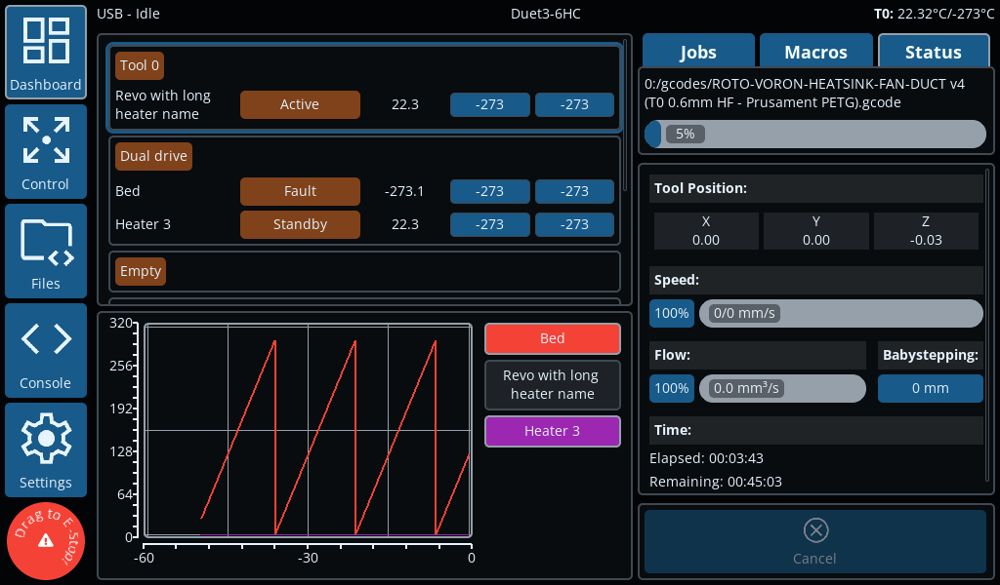 |

### Control workflows

| Capability | Screenshot |
| --- | --- |
| Move controls | 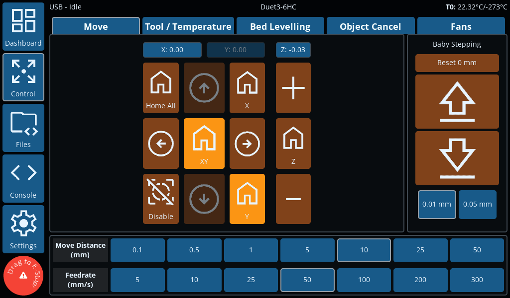 |
| Temperature controls | 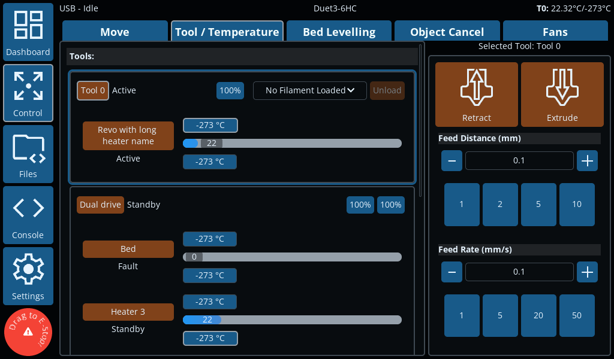 |
| Bed levelling | 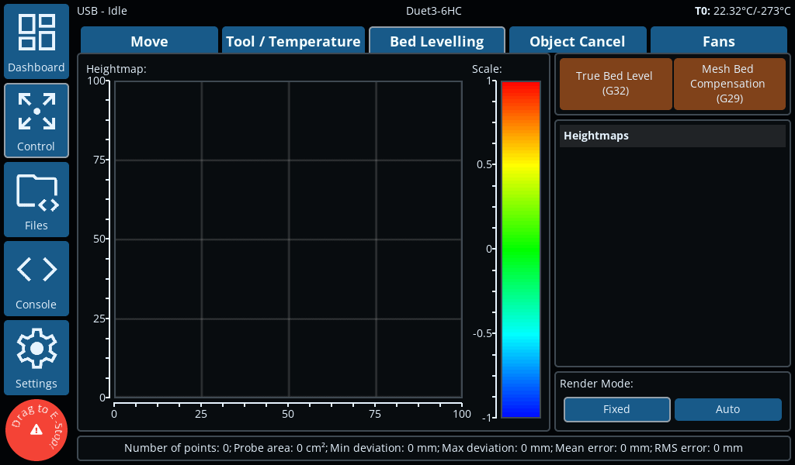 |
| Object Cancel | 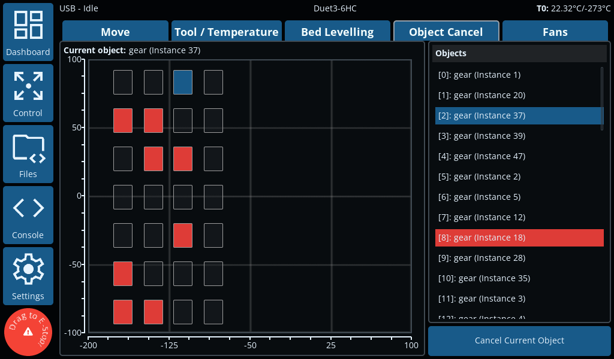 |
| Fans | 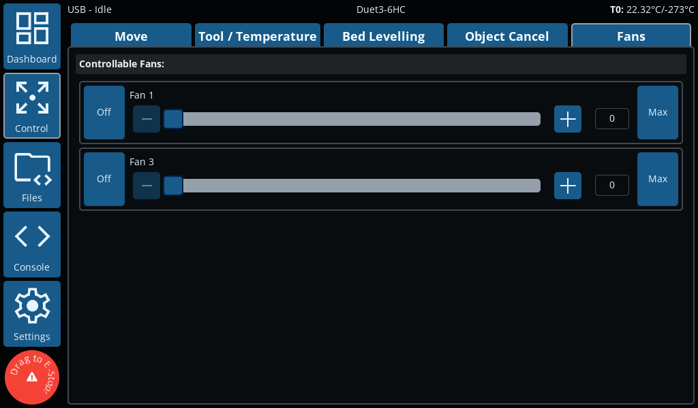 |

### File and macro workflows

| Capability | Screenshot |
| --- | --- |
| Macro listing | 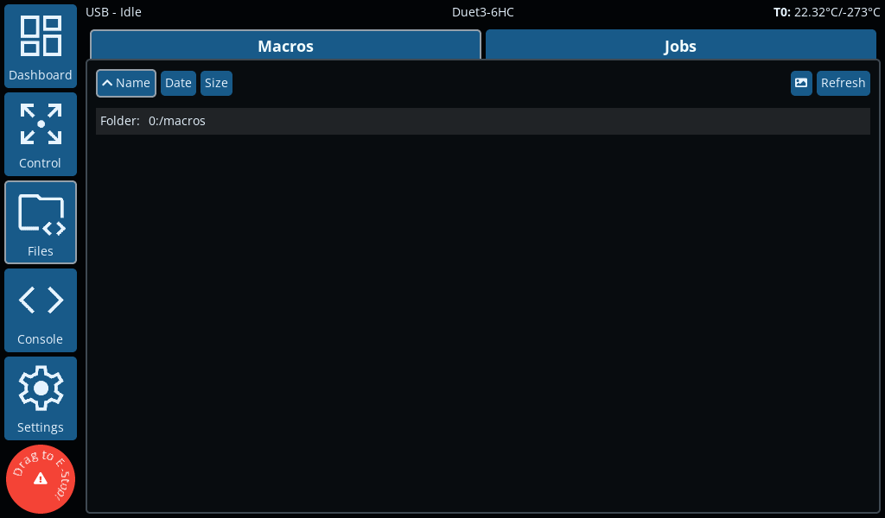 |

### Console

| Capability | Screenshot |
| --- | --- |
| Console | 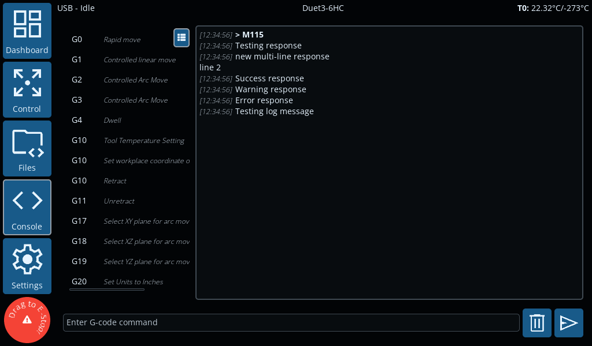

### Settings and navigation

| Capability | Screenshot |
| --- | --- |
| General settings | 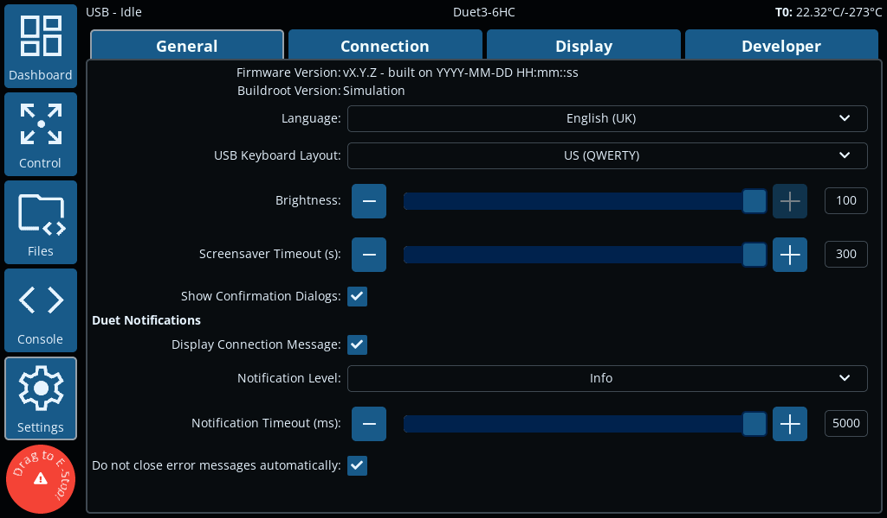 |
| Connection settings | 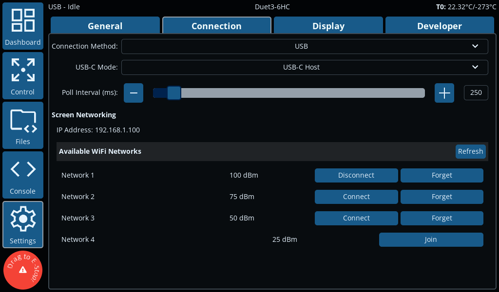 |
| Display settings | 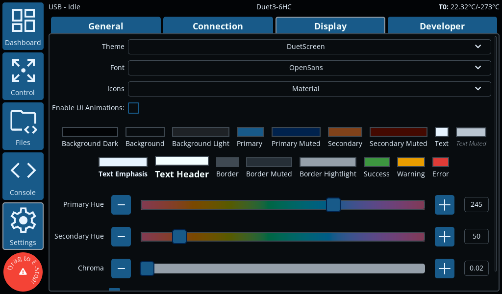 |
| Developer settings | 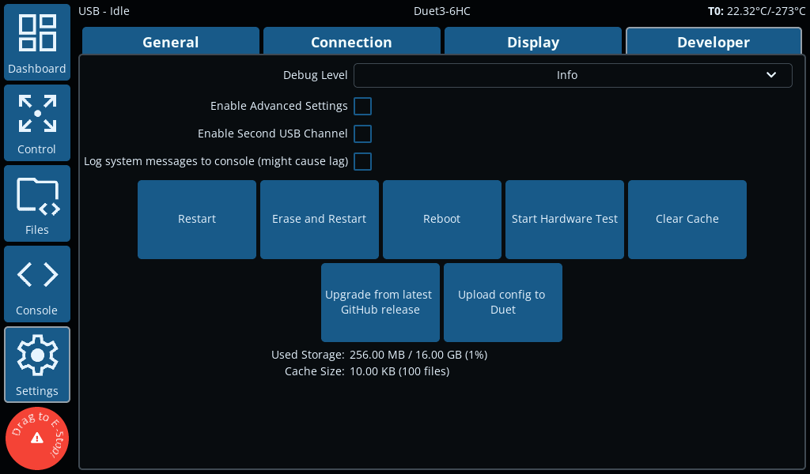 |

### Themes

| Theme | Screenshot |
| --- | --- |
| DuetScreen | 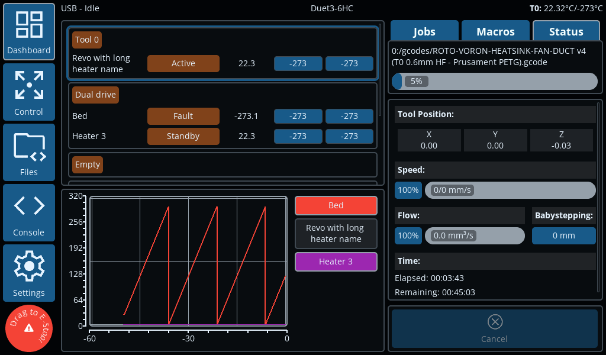 |
| Flat | 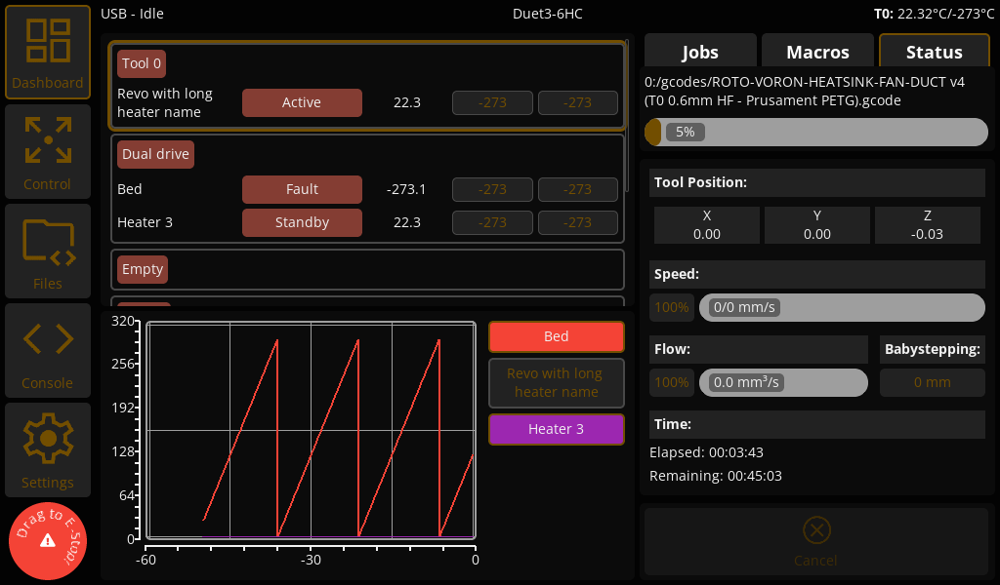 |
| Industrial | 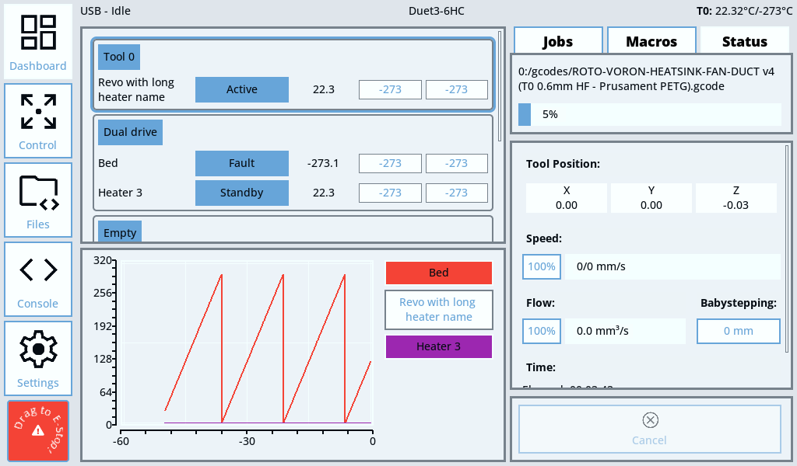 |
| Neon | 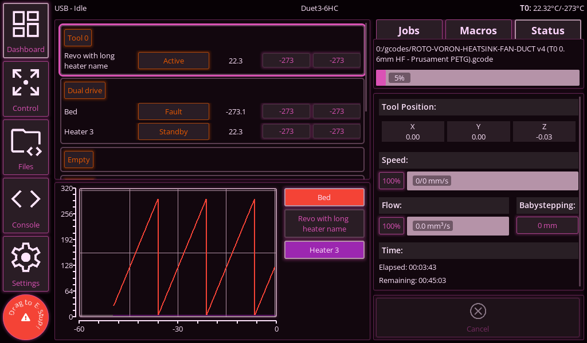 |
| Retro | 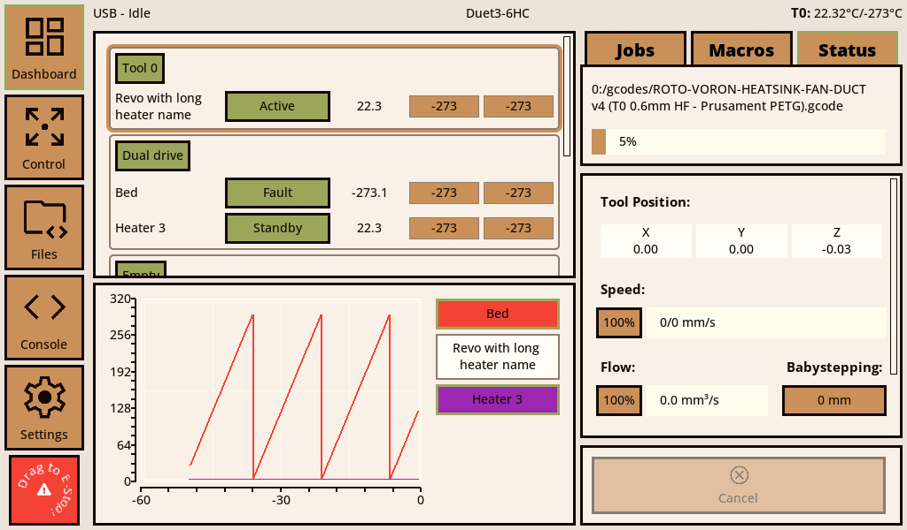 |
| Soft | 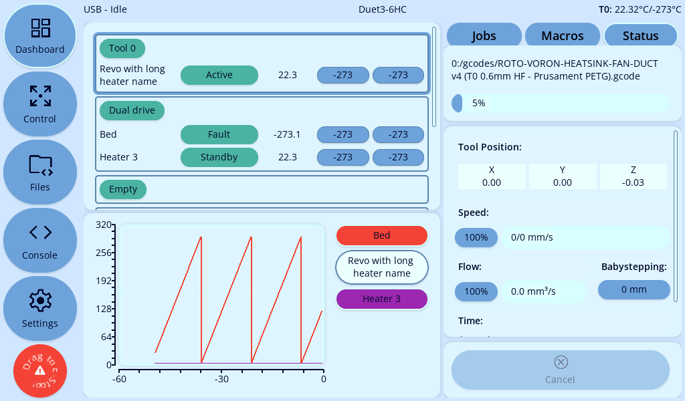 |

## Getting started

### Flashing a new Duet3D screen
1. Download the latest `sdcard.img` from the release page.
2. Flash a microSD card with the image
    - use [balenaEtcher](https://www.balena.io/etcher/) or [rufus](https://rufus.ie/) on Windows
    - use `dd` on Linux
        - ```bash
            sudo dd if=sdcard.img of=/dev/sdX bs=4M
            ```
        - replace `sdX` with the correct device name for your microSD card. Be very careful when using `dd`, as it can overwrite any drive on your system if you specify the wrong one.
3. Insert the microSD card into the Duet3D screen and power it on.


### Connecting the Duet3D screen to a WiFi network
There are a few methods to connect the Duet3D screen to a WiFi network:

1. You can copy a file called `wpa_supplicant.conf` to the root of the microSD card. This file should contain the WiFi credentials in the following format:
    ```
    ctrl_interface=/var/run/wpa_supplicant
    update_config=1
    ap_scan=1

    network={
        ssid="your-SSID"
        psk="your-PASSWORD"
        key_mgmt=WPA-PSK
    }
    ```
    - This method is the easiest if you are setting up multiple screens, or you know the WiFi credentials in advance.
    - This file should be placed on the microSD card after it has been flashed and before the first boot. The screen will read this file on the first boot and connect to the WiFi network automatically. After the first boot, this file is ignored for security reasons.
2. Alternatively, you can connect to a network using the “Settings” page in the GUI.
    - This method is useful if you are setting up a single screen and you do not know the WiFi credentials in advance.
    - This method can be used after first boot if you do not want to pre-seed `wpa_supplicant.conf`.


## Powering the Duet3D screen
The Duet3D screen can be powered in the following ways:
- **5V_IN**: This is the recommended method. 
- **USB-C**: Relies on the connected host/device to supply sufficient power.
- **UART5**: This is a legacy method for compatibility with PanelDue wiring. It is not recommended for new installations.

> [!WARNING]
> All the power methods are **NOT** isolated. This means that if you connect the screen to a mainboard, the mainboard must be powered by the same power supply as the screen. If you do not do this, you may damage the screen or the mainboard.
> - The screen is designed to be powered by a 5V power supply. If you are using a 12V or 24V power supply, you will need to use a buck converter to step down the voltage to 5V. **You will likely damage the screen and any connected devices if you do not do this**.

## Connecting to a Duet3D mainboard
Multiple methods are available to connect the Duet3D screen to a mainboard. The recommended method is to use a USB cable. This allows for the best performance and is the easiest to set up.

### USB
1. Connect the Duet3D screen to the mainboard using a USB cable.
    - **Either** the **USB-A** and **USB-C** ports on the screen can be used.
    - If using the **USB-C** port, make sure to set the screen to USB **host mode**.
2. In the GUI, select the USB connection method.

> [!NOTE]
> When the Duet3D screen detects a USB connection to a Duet3D mainboard, it will automatically send `M575 P0 S4` to configure the mainboard for USB communication.

### WiFi
> [!NOTE]
> The screen has a built-in WiFi module, it also supports external WiFi modules with the `RTL8188FU` chipset.
> - If using the built-in WiFi module, the USB-C port must be set to `Internal WiFi`, this is done in the “Settings” page in the GUI.
> - If using an external WiFi module, connect it to the USB-A port on the screen, or use the USB-C port and set it to `USB-C Host`.
> - There are multiple variants of the `RTL8188` chipset. Currently the screen only supports `RTL8188FU`. Other variants are unlikely to work.
> You might need to reboot the screen after enabling the WiFi module.

1. Ensure the Duet3D screen is connected to the same WiFi network as the mainboard.
    - See the [Connecting the Duet3D screen to a WiFi network](#connecting-the-duet3d-screen-to-a-wifi-network) section above.
2. In the GUI, select the WiFi connection method.
4. Enter the IP address of the mainboard.

### UART

> [!WARNING]
> This method is for legacy support only to provide an easy upgrade path for PanelDue users. It is not recommended for new installations.

1. Connect the Duet3D screen to the mainboard using a UART cable.
    - Use connector `UART Duet` on the screen.
2. In the GUI, select the UART connection method.
3. Set the baud rate on the mainboard to `115200`. use `M575 P1 S4 B115200` in config.g, this is similar to connecting a PanelDue, other than the default baud rate is 115200

#### Wiring
For a Duet3 IO0 port for UART is as follows:

| Duet3 Mainboard - IO0 Connector     | DuetScreen - UART Duet connector    |
| ------------- | ------------- |
| 5V | 5V |
| io0.out | U5-R |
| GND | GND|
| io0.in | U5-T |

## Updating the Duet3D screen
Several methods are available to update the Duet3D screen.

1. **Using the GUI**
    - Copy the update file (`DuetScreen.tar.gz`) to the root directory of a USB flash drive.
    - Insert the USB flash drive into the Duet3D screen.
    - In the GUI you will be prompted to update the screen.
    - If the update is successful, the screen will automatically reboot. This will appear as a brief flash and the GUI will return to the home screen.
    - The update will create an empty file called `upgraded` in the root directory of the USB flash drive. This file is used to indicate that the update was successful.

    The screen will automatically check for updates when if it connects to the internet. If an update is available, you will be asked if you want to install the update. Installing will typically take a couple seconds and the screen will automatically restart if the update is successful.

2. **Force Update**
    - If the GUI is not working, you can force an update by renaming the update file to `update.tar.gz` and placing it in the **root directory of the USB flash drive OR microSD** card.
    - Insert the USB flash drive or microSD card into the Duet3D screen.
    - *(If using a microSD card)* Power on the screen and it will automatically update.
    - The update will have succeeded if the `update.tar.gz` file is removed from the root directory of the flash drive or microSD card.
3. **Fallback**
    - If the screen is still not working, you will have to reflash the microSD card with the latest image.

> [!warning]
> Occasionally, an update may require the whole microSD card to be reflashed. This will be indicated in the release notes.
> 
>
> In this case, follow the instructions in the [Flashing a new Duet3D screen](#flashing-a-new-duet3d-screen) section above.

After updating the screen, it will show an update success or update failed message next time the screen starts up.

| Update status | Screenshot |
| --- | --- |
| Success |  |
| Failed |  |
| Recommend updating buildroot |  |

## USB Ports
The Duet3D screen has two USB ports:
- USB-A: This port is always a host port. 
    - It can be used to connect to a Duet3D mainboard, wifi modules, USB-ethernet adapters, or USB flash drives.
- USB-C: This port can be a host or device port.
    - It can be used to connect to a Duet3D mainboard, wifi modules, USB-ethernet adapters, or USB flash drives in host mode.
    - It can be used to connect to a PC in device mode for software debugging.
    - It can be used to power the screen in either mode (assuming the attached device/host is able to supply power).
        - Some smart chargers will not power the screen if it is a USB host

> [!WARNING]
> A Duet3D mainboard CANNOT provide power to the screen via the USB-C. Always power the screen via the 5V_IN port when using USB

USB hubs are supported **if they are NOT smart**. A smart hub is one that requires a driver to work. This includes most USB-C hubs. If you are using a USB-C hub, make sure it is a dumb hub. A dumb hub is one that does not require a driver to work. This includes most USB-A hubs. If in doubt, use a USB-A hub.

## Building the project
Notes on how to build the project are found in [DEVELOPMENT.md](docs/DEVELOPMENT.md).

## Configuring Screen Settings
It is possible to configure the screen settings without using the GUI. This is done by creating a file called `duetscreen.json`. This file stores the non-volatile settings for the screen.

For information on what settings are available, look at [Storage.cpp](src/Storage.cpp) to find all the supported keys, there are a few dynamically named keys which can be found by searching the code for `StorageKeyRunTime` if needed (mainly used for themes). Key names are split by `:` to indicate hierarchy. For example the key `ui:move:selected_feedrate` would refer to:
```json
{
  "ui": {
    "move": {
      "selected_feedrate": <value>
    }
  }
}
```
Any key not defined in the `duetscreen.json` file will use the default value defined in [Storage.cpp](src/Storage.cpp).

This file should be placed in the root directory of the microSD card. When the screen first boots, it will read this file and apply the settings.

> [!NOTE]
> This only works on first boot for security reasons. After the first boot, settings need to be changed via the GUI.

## Contributing
Contributions are welcome! Please see [DEVELOPMENT.md](docs/DEVELOPMENT.md) for more information on how to contribute.

Ensure all commit messages follow the format outlined in [commit messages](docs/DEVELOPMENT.md#commit-messages).
